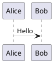

# md2docx

A Python library and CLI tool for converting Markdown files to Word (DOCX) documents without requiring Pandoc.

## Features

- **Full Markdown Support**: Headings, paragraphs, bold, italic, strikethrough, inline code
- **Lists**: Bullet lists, numbered lists, task lists with up to 3 levels of nesting
- **Tables**: With alignment support, header styling, and zebra striping
- **Code Blocks**: Syntax highlighting via Pygments, styled backgrounds and borders
- **Images**: Local files and URLs, auto-scaling, optional captions
- **Diagrams**: Mermaid, PlantUML, and ASCII/Ditaa rendering
- **Block Quotes**: With proper styling and nested quote support
- **Footnotes**: Rendered as endnotes with reference links
- **Front Matter**: YAML metadata for title, author, date, abstract
- **Document Structure**: Title pages, table of contents, headers/footers, page numbers

## Installation

### From the repository

```bash
# Navigate to the scripts directory
cd scripts

# Install in development mode
pip install -e .
```

### Dependencies

Required:
- `python-docx` - DOCX generation
- `markdown-it-py` - Markdown parsing
- `mdit-py-plugins` - Extended Markdown syntax
- `python-frontmatter` - YAML metadata parsing
- `Pygments` - Syntax highlighting
- `Pillow` - Image handling
- `requests` - Remote image/diagram fetching

Optional (for diagrams):
- `mermaid-cli` (mmdc) - Mermaid diagram rendering
- `plantuml.jar` - PlantUML diagram rendering
- `ditaa.jar` - Ditaa diagram rendering

## Usage

### Command Line

```bash
# Basic conversion
md2docx input.md

# Custom output name
md2docx input.md -o report.docx

# Include table of contents
md2docx input.md --toc

# Skip diagram rendering
md2docx input.md --no-diagrams

# Skip title page
md2docx input.md --no-title-page

# Use A4 page size
md2docx input.md --page-size A4

# Use minimal style preset
md2docx input.md --style minimal

# Batch convert directory
md2docx ./docs/ --batch

# Enable debug logging
md2docx input.md --debug

# Quiet mode (errors only)
md2docx input.md -q
```

### Python API

```python
from md2docx import MarkdownToDocxConverter

# Basic usage
converter = MarkdownToDocxConverter()
converter.convert("input.md", "output.docx")

# With options
converter = MarkdownToDocxConverter(
    enable_diagrams=True,
    include_toc=True,
    include_title_page=True,
    debug=False,
)
converter.convert("document.md", "document.docx")

# Convert from string
markdown_content = """
# Hello World

This is a **test** document.
"""
converter.convert_string(markdown_content, "output.docx")

# Batch conversion
converter.batch_convert("./docs/", "./output/", pattern="*.md")
```

### Custom Styling

```python
from md2docx import MarkdownToDocxConverter, DocumentStyle
from md2docx.styles import FontStyle, HeadingStyle, PageSize

# Create custom style
style = DocumentStyle()
style.page.size = PageSize.A4
style.body.font.name = "Arial"
style.body.font.size_pt = 11.0
style.heading1.font = FontStyle(
    name="Arial Black",
    size_pt=24.0,
    bold=True,
    color="003366"
)

# Use custom style
converter = MarkdownToDocxConverter(style=style)
converter.convert("input.md")
```

### Style Presets

Available presets:
- `default` - Professional blue headings, Calibri font
- `minimal` - Clean black/gray styling
- `academic` - Times New Roman, double-spaced, indented paragraphs
- `modern` - Segoe UI with contemporary colors

```python
from md2docx import MarkdownToDocxConverter
from md2docx.styles import StylePreset

converter = MarkdownToDocxConverter(style_preset=StylePreset.ACADEMIC)
converter.convert("thesis.md")
```

## Front Matter

YAML front matter at the beginning of the document controls metadata:

```yaml
---
title: "My Document Title"
author: "John Doe"
date: "2025-01-14"
abstract: "This is the document abstract."
keywords:
  - markdown
  - docx
---
```

## Supported Markdown Elements

### Text Formatting
- **Bold**: `**text**` or `__text__`
- *Italic*: `*text*` or `_text_`
- ~~Strikethrough~~: `~~text~~`
- `Inline code`: `` `code` ``
- Combined: `***bold italic***`

### Headings
```markdown
# Heading 1
## Heading 2
### Heading 3
#### Heading 4
##### Heading 5
###### Heading 6
```

### Lists
```markdown
- Bullet item
  - Nested item
    - Deeply nested

1. Numbered item
   1. Sub-item

- [x] Completed task
- [ ] Incomplete task
```

### Tables
```markdown
| Left | Center | Right |
|:-----|:------:|------:|
| L    |   C    |     R |
```

### Code Blocks
````markdown
```python
def hello():
    print("Hello!")
```
````

### Block Quotes
```markdown
> This is a quote.
>
> > Nested quote.
```

### Links and Images
```markdown
[Link text](https://example.com)

```

### Diagrams

Mermaid:
````markdown

````

PlantUML:
````markdown

````

## Diagram Support

### Mermaid

Requires [mermaid-cli](https://github.com/mermaid-js/mermaid-cli):

```bash
npm install -g @mermaid-js/mermaid-cli
```

Supported diagram types:
- Flowcharts
- Sequence diagrams
- Class diagrams
- State diagrams
- ER diagrams
- Gantt charts
- Pie charts
- And more

### PlantUML

Uses either local jar or public server:

```bash
# Option 1: Download plantuml.jar
wget https://sourceforge.net/projects/plantuml/files/plantuml.jar
export PLANTUML_JAR=/path/to/plantuml.jar

# Option 2: Falls back to public server automatically
```

### Ditaa/ASCII Art

For ASCII art diagrams:

```bash
# Optional: Install ditaa for better rendering
wget https://sourceforge.net/projects/ditaa/files/ditaa.jar
export DITAA_JAR=/path/to/ditaa.jar
```

ASCII art is rendered using PIL if ditaa is not available.

## Document Output

The generated DOCX includes:

- **Title page** (if metadata present): Centered title, author, date, abstract
- **Table of contents** (optional): Word TOC field codes for auto-update
- **Headers**: Document title and date (skips first page)
- **Footers**: Page numbers ("Page X of Y")
- **Proper styling**: Consistent fonts, spacing, and colors

## Testing

```bash
# Run the test suite
python -m md2docx.tests.test_converter

# Or using pytest
pytest scripts/md2docx/tests/
```

## Architecture

```
md2docx/
├── __init__.py         # Package exports
├── cli.py              # CLI interface
├── converter.py        # Main conversion orchestration
├── document.py         # Document creation and structure
├── parser.py           # Markdown parsing
├── styles.py           # Style definitions
├── utils.py            # Utilities and helpers
├── elements/           # Element handlers
│   ├── text.py         # Paragraphs, headings, formatting
│   ├── lists.py        # Bullet and numbered lists
│   ├── tables.py       # Tables
│   ├── code.py         # Code blocks
│   ├── media.py        # Images
│   └── blocks.py       # Blockquotes, horizontal rules
├── diagrams/           # Diagram rendering
│   ├── detector.py     # Diagram type detection
│   ├── mermaid.py      # Mermaid renderer
│   ├── plantuml.py     # PlantUML renderer
│   ├── ditaa.py        # Ditaa/ASCII renderer
│   └── cache.py        # Diagram caching
├── samples/            # Sample documents
│   └── sample.md       # Comprehensive sample
└── tests/              # Test suite
    └── test_converter.py
```

## Troubleshooting

### Common Issues

**"python-docx not found"**
```bash
pip install python-docx
```

**"Syntax highlighting not working"**
```bash
pip install Pygments
```

**"Mermaid diagrams not rendering"**
```bash
npm install -g @mermaid-js/mermaid-cli
```

**"Images not appearing"**
- Ensure image paths are relative to the markdown file
- Check that image files exist and are readable
- For URLs, ensure network connectivity

### Debug Mode

Enable debug logging for troubleshooting:

```bash
md2docx input.md --debug
```

Or in Python:

```python
converter = MarkdownToDocxConverter(debug=True)
```

## License

Copyright (c) 2025 TrailLensCo. All rights reserved.

This software is proprietary and confidential.
