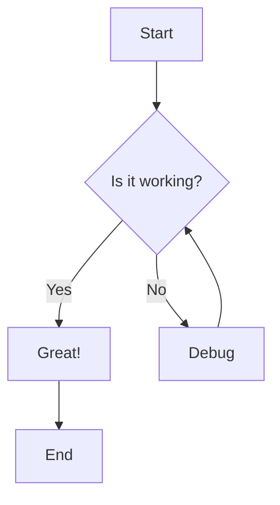
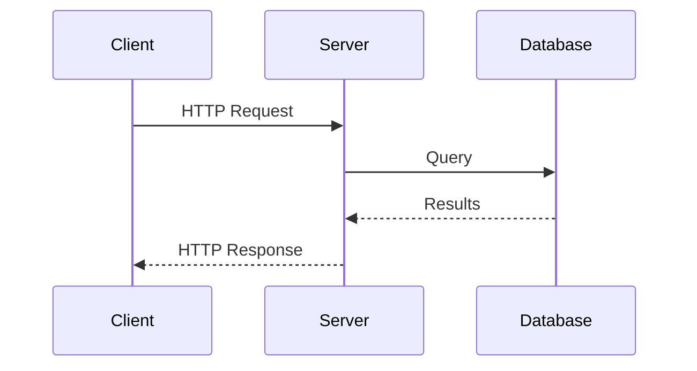
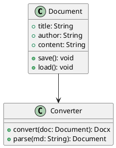

# Introduction

This is a comprehensive sample document that exercises **all features** of the md2docx converter. It includes various Markdown elements to verify proper conversion to Word format.

## Text Formatting

Regular text can include **bold text**, *italic text*, ***bold and italic***, and ~~strikethrough text~~. You can also use `inline code` for technical terms.

Paragraphs are separated by blank lines. This ensures proper spacing in the output document.

Multiple formatting can be combined: **bold with *nested italic* inside** works correctly.

## Headings

### Third Level Heading

Content under the third level heading.

#### Fourth Level Heading

Content under the fourth level heading.

##### Fifth Level Heading

Content under the fifth level heading.

###### Sixth Level Heading

Content under the sixth level heading.

## Lists

### Bullet Lists

- First item
- Second item
  - Nested item 2.1
  - Nested item 2.2
    - Deeply nested item
- Third item

### Numbered Lists

1. First numbered item
2. Second numbered item
   1. Sub-item 2.1
   2. Sub-item 2.2
3. Third numbered item

### Task Lists

- [x] Completed task
- [x] Another completed task
- [ ] Incomplete task
- [ ] Another incomplete task

## Links

Visit [TrailLens](https://traillenshq.com) for more information.

You can also link to [external documentation](https://docs.example.com "Documentation Link") with titles.

## Block Quotes

> This is a block quote. It can contain multiple paragraphs and other formatting.
>
> Second paragraph in the block quote with **bold** and *italic* text.
>
> > Nested block quotes are also supported.

## Code Blocks

### Python Example

```python
def fibonacci(n: int) -> list[int]:
    """Generate Fibonacci sequence up to n terms."""
    if n <= 0:
        return []
    elif n == 1:
        return [0]

    sequence = [0, 1]
    while len(sequence) < n:
        sequence.append(sequence[-1] + sequence[-2])

    return sequence

# Example usage
result = fibonacci(10)
print(f"First 10 Fibonacci numbers: {result}")
```

### JavaScript Example

```javascript
async function fetchUserData(userId) {
    try {
        const response = await fetch(`/api/users/${userId}`);
        if (!response.ok) {
            throw new Error('User not found');
        }
        const userData = await response.json();
        return userData;
    } catch (error) {
        console.error('Failed to fetch user:', error);
        throw error;
    }
}
```

### Shell Script Example

```bash
#!/bin/bash
set -euo pipefail

# Check if required tool is available
if ! command -v docker &> /dev/null; then
    echo "Error: Docker is not installed" >&2
    exit 1
fi

# Start the application
docker-compose up -d
echo "Application started successfully"
```

### Plain Code Block

```
This is a plain code block without syntax highlighting.
It preserves whitespace and formatting exactly as written.
    Indentation is preserved.
        Even multiple levels.
```

## Tables

### Basic Table

| Name | Age | City |
|------|-----|------|
| Alice | 28 | New York |
| Bob | 35 | San Francisco |
| Carol | 42 | Chicago |

### Aligned Table

| Left Aligned | Center Aligned | Right Aligned |
|:-------------|:--------------:|--------------:|
| Left | Center | Right |
| More left | More center | More right |
| Data | Data | 12345 |

### Complex Table

| Feature | Status | Priority | Notes |
|---------|:------:|:--------:|-------|
| User Authentication | ✓ | High | Implemented with OAuth 2.0 |
| Data Export | ✓ | Medium | Supports CSV and JSON |
| Real-time Updates | ⚠ | High | In progress |
| Mobile Support | ✗ | Low | Planned for Q2 |

## Horizontal Rules

Content before the horizontal rule.

---

Content after the horizontal rule.

## Images

Images can be embedded from local paths or URLs:


*Caption: This is a placeholder image demonstrating image embedding.*

## Diagrams

### Mermaid Flowchart



### Mermaid Sequence Diagram



### PlantUML Class Diagram



### ASCII Diagram

```ascii
+------------------+     +------------------+
|                  |     |                  |
|    Frontend      |---->|    Backend       |
|    (React)       |     |    (FastAPI)     |
|                  |     |                  |
+------------------+     +--------+---------+
                                  |
                                  v
                         +--------+---------+
                         |                  |
                         |    Database      |
                         |    (DynamoDB)    |
                         |                  |
                         +------------------+
```

## Footnotes

Here is a statement with a footnote[^1].

Another statement with a different footnote[^note].

[^1]: This is the first footnote content.

[^note]: This is a named footnote with more detailed information.

## Definition Lists

Term 1
: Definition for term 1.

Term 2
: First definition for term 2.
: Second definition for term 2.

## Special Characters

The converter handles special characters properly:

- Ampersand: &
- Less than: <
- Greater than: >
- Quotes: "double" and 'single'
- Em dash: —
- En dash: –
- Ellipsis: …
- Copyright: ©
- Trademark: ™

## Nested Content

### Lists in Blockquotes

> Here's a list inside a block quote:
> - First item
> - Second item
> - Third item

### Formatting in Tables

| Column 1 | Column 2 |
|----------|----------|
| **Bold** | *Italic* |
| `code` | ~~strike~~ |

## Conclusion

This sample document has demonstrated:

1. **Text formatting** including bold, italic, and code
2. **Lists** of various types including task lists
3. **Tables** with different alignments
4. **Code blocks** with syntax highlighting
5. **Diagrams** using Mermaid and PlantUML
6. **Block quotes** with nested content
7. **Links** and footnotes

The md2docx converter should handle all these elements correctly and produce a well-formatted Word document.

---

*End of sample document*
